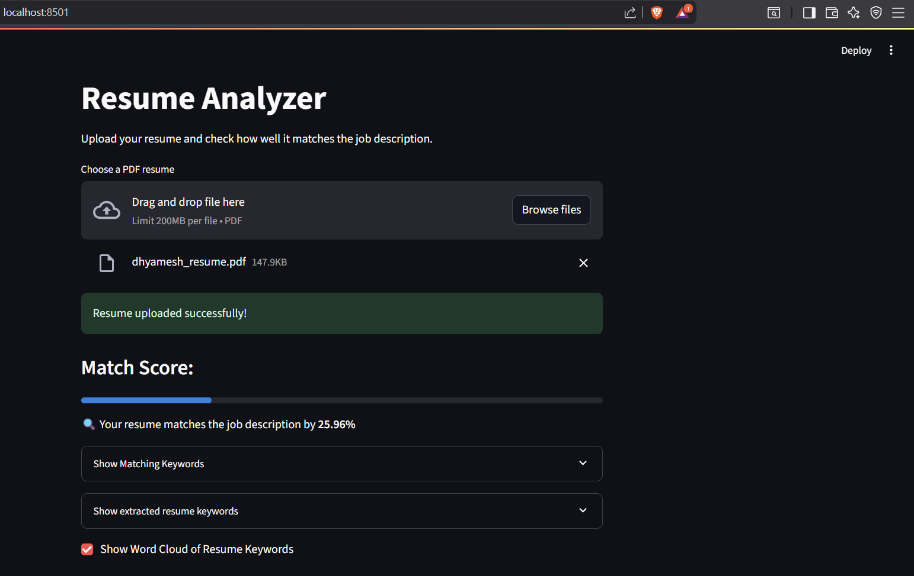
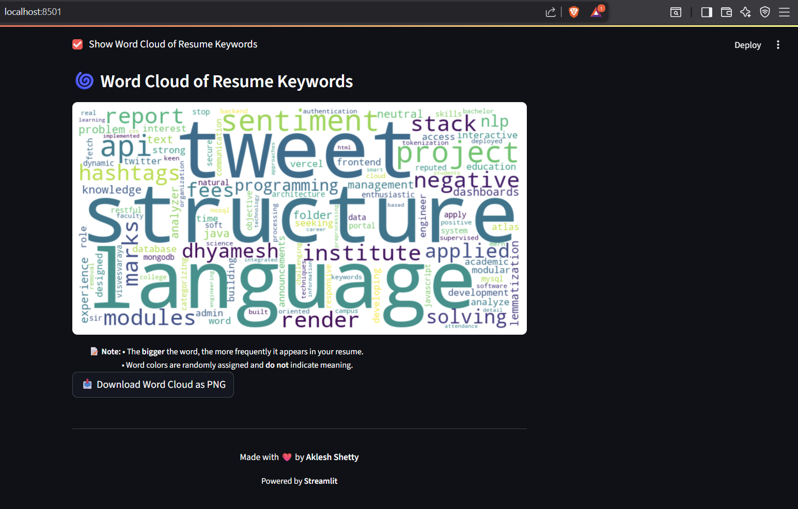

# 🧠 Resume Analyzer

This project is a simple yet effective resume analysis tool developed using Python, NLP, and Streamlit. It helps you understand how well your resume matches a particular job description. The tool calculates a **match score** and even highlights the **common keywords** between your resume and the job role. 

There’s also a **Word Cloud** to show which keywords are appearing the most in your resume — this is useful to understand whether your resume is focusing on the right skills and terms.

---

## 📌 Why this project?

While preparing for placements and job applications, many students and freshers struggle to understand if their resume is really aligned with the job they are applying for. This tool solves that problem in a simple way — just upload your resume and the job description, and it gives you helpful insights instantly.

---

## 🔧 Features

- ✅ Upload resume in PDF format
- ✅ Paste or load a job description from a `.txt` file
- ✅ Calculates a **match score** based on content similarity
- ✅ Displays **matching keywords** between resume and JD
- ✅ Generates a **Word Cloud** from the resume content
- ✅ Option to download the Word Cloud as a PNG image
- ✅ Clean, simple, and beginner-friendly web interface using Streamlit

---

## 🧪 Technologies Used

- Python 3  
- Streamlit  
- spaCy  
- scikit-learn  
- WordCloud  
- Matplotlib  
- PyMuPDF (for PDF parsing)

---

## 📁 Folder Structure

resume_analyzer/
│
├── app.py # Main Streamlit application
├── resume_parser.py # Logic to extract text and keywords from resume
├── job_description.txt # Sample JD file
├── sample_resume.pdf # Sample resume for testing
├── requirements.txt # Required Python packages

yaml
Copy
Edit

---

## 🚀 How to Run Locally

1. **Clone the repo** or download this folder  
2. Install the dependencies:
    ```bash
    pip install -r requirements.txt
    ```
3. Run the Streamlit app:
    ```bash
    streamlit run app.py
    ```

4. Open the browser where the app is running (usually `http://localhost:8501`)

---

## 📷 Screenshots

### App Interface


### Output in localhost
 


---

## ✍️ Author

Made with dedication by **Aklesh Shetty**,  
Engineering Student | CSE - AI & ML 
Sir M. Visvesvaraya Institute of Technology
📍 Bengaluru, Karnataka, India

---

## 🛠️ Future Ideas

- Add option to upload job descriptions in PDF as well  
- Provide suggestions to improve resume content  
- Highlight missing keywords visually  
- Support multiple resume uploads to compare versions

---

## 🙏 Acknowledgements

Special thanks to:
- **Kaggle** and **Coursera** for inspiration and open datasets  
- Open-source Python libraries and tutorials that helped during development

---

## 🧾 License

This project is open-source and available for learning and portfolio purposes. Feel free to fork and experiment.
